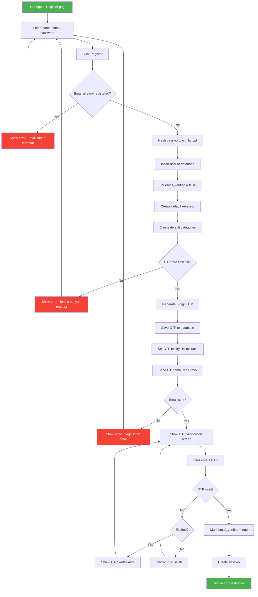
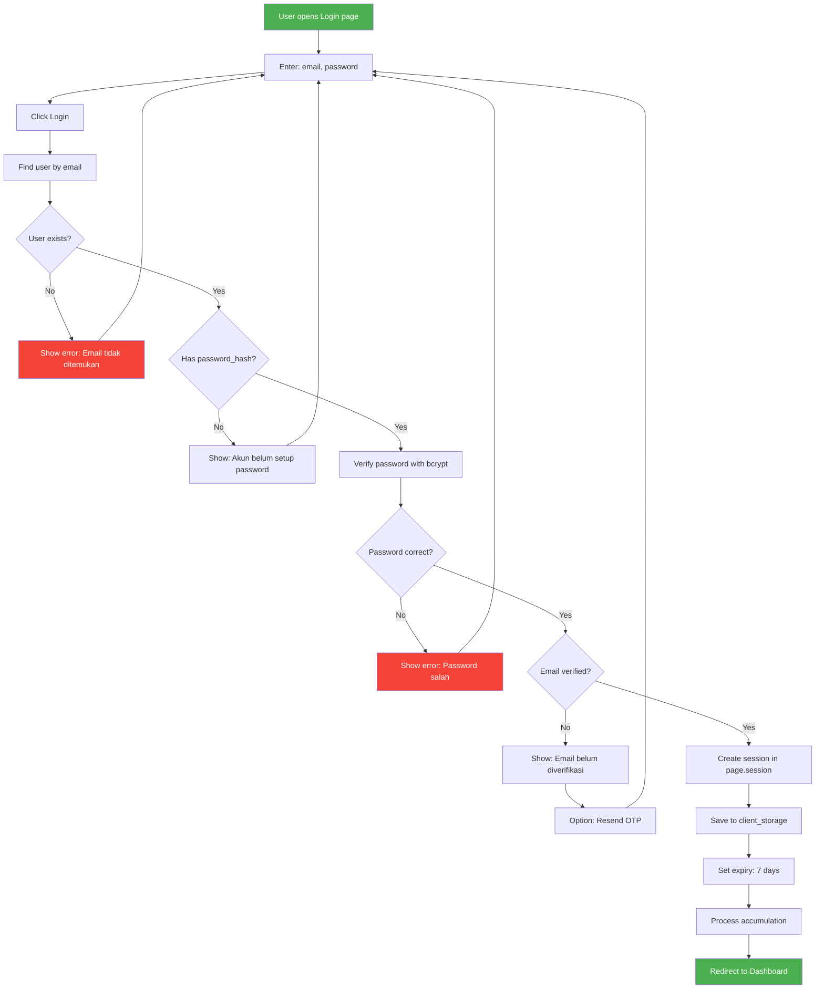
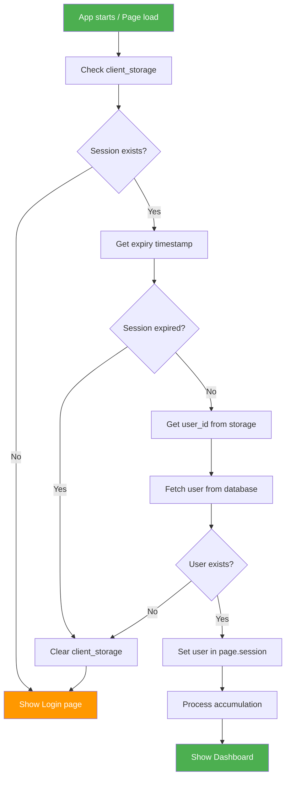
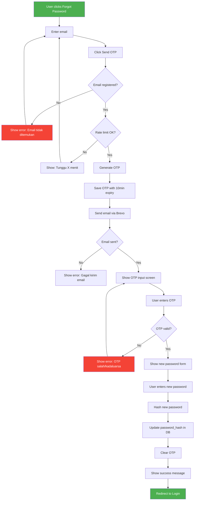
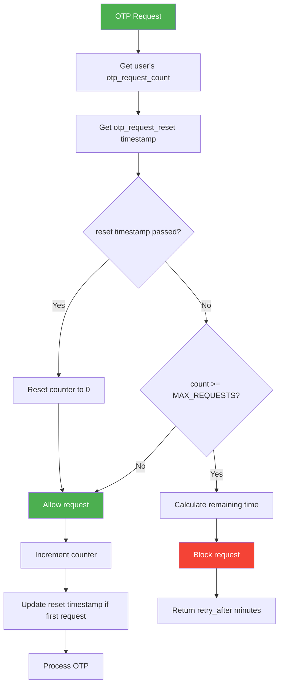

# Authentication System

Complete documentation for user authentication, session management, and security.

---

## Table of Contents

1. [Overview](#1-overview)
2. [Registration Flow](#2-registration-flow)
3. [Login Flow](#3-login-flow)
4. [Session Management](#4-session-management)
5. [Password Reset Flow](#5-password-reset-flow)
6. [OTP Rate Limiting](#6-otp-rate-limiting)
7. [Security Implementation](#7-security-implementation)
8. [API Reference](#8-api-reference)

---

## 1. Overview

### Authentication Architecture

```
┌─────────────────────────────────────────────────────────────┐
│                         Client                               │
├─────────────────────────────────────────────────────────────┤
│  ┌─────────────┐  ┌─────────────┐  ┌─────────────────────┐  │
│  │ Login Page  │  │Register Page│  │   Reset Password    │  │
│  └──────┬──────┘  └──────┬──────┘  └──────────┬──────────┘  │
│         │                │                     │             │
│         └────────────────┼─────────────────────┘             │
│                          ▼                                   │
│              ┌───────────────────┐                          │
│              │   data_service.py │  (UI Bridge Layer)       │
│              └─────────┬─────────┘                          │
│                        │                                     │
├────────────────────────┼────────────────────────────────────┤
│                        ▼                                     │
│              ┌───────────────────┐                          │
│              │   UserService     │  (Database Layer)        │
│              └─────────┬─────────┘                          │
│                        │                                     │
│         ┌──────────────┼──────────────┐                     │
│         ▼              ▼              ▼                     │
│  ┌────────────┐ ┌────────────┐ ┌────────────┐              │
│  │  Supabase  │ │   bcrypt   │ │   Brevo    │              │
│  │ (Database) │ │ (Hashing)  │ │  (Email)   │              │
│  └────────────┘ └────────────┘ └────────────┘              │
│                                                              │
└─────────────────────────────────────────────────────────────┘
```

### Key Components

| Component     | Location           | Purpose                        |
| ------------- | ------------------ | ------------------------------ |
| UserService   | `database.py`      | Database operations for auth   |
| data_service  | `data_service.py`  | UI bridge with session helpers |
| email_service | `email_service.py` | OTP email delivery             |
| bcrypt        | dependency         | Password hashing               |

### Session Storage

| Storage               | Scope            | Duration      | Use                |
| --------------------- | ---------------- | ------------- | ------------------ |
| `page.session`        | Single page load | Until refresh | Active user data   |
| `page.client_storage` | Browser          | 7 days        | Persistent session |

---

## 2. Registration Flow

### Flowchart



### Implementation

```python
# data_service.py

def register_user(nama: str, email: str, password: str) -> dict:
    """
    Register new user with email verification.

    Returns:
        Success: {"success": True, "user_id": int, "needs_otp": True}
        Failure: {"success": False, "message": str}
    """
    # Step 1: Register in database
    result = UserService.register_with_email(nama, email, password)

    if not result["success"]:
        return result

    user_id = result["user_id"]

    # Step 2: Check rate limit
    rate_check = UserService.check_otp_rate_limit(user_id)
    if not rate_check["allowed"]:
        return {
            "success": False,
            "message": rate_check["message"]
        }

    # Step 3: Generate and send OTP
    otp = generate_otp()
    UserService.save_otp(user_id, otp, expires_minutes=10)
    UserService.increment_otp_request(user_id)

    email_result = send_otp_email(email, otp, "verification")

    if not email_result["success"]:
        return {
            "success": False,
            "message": "Gagal mengirim email verifikasi"
        }

    return {
        "success": True,
        "user_id": user_id,
        "needs_otp": True
    }
```

```python
# database.py - UserService

@staticmethod
def register_with_email(nama: str, email: str, password: str) -> dict:
    """Register new user with hashed password."""

    # Check if email exists
    existing = UserService.get_user_by_email(email)
    if existing:
        return {"success": False, "message": "Email sudah terdaftar"}

    # Hash password
    password_hash = bcrypt.hashpw(
        password.encode('utf-8'),
        bcrypt.gensalt()
    ).decode('utf-8')

    try:
        # Insert user
        result = supabase.table('users').insert({
            "nama": nama,
            "email": email,
            "password_hash": password_hash,
            "email_verified": False,
            "tema": "ungu",
            "dark_mode": False,
            "avatar": "🐷"
        }).execute()

        user_id = result.data[0]['id']

        # Create default rekening
        supabase.table('rekening').insert({
            "user_id": user_id,
            "saldo": 0
        }).execute()

        # Create default multi_rekening (Cash)
        MultiRekeningService.setup_default(user_id)

        # Create default categories
        default_categories = ["Makan", "Transport", "Belanja", "Hiburan", "Lainnya"]
        for cat in default_categories:
            KategoriService.add(user_id, cat)

        return {"success": True, "user_id": user_id}

    except Exception as e:
        return {"success": False, "message": str(e)}
```

---

## 3. Login Flow

### Flowchart



### Implementation

```python
# data_service.py

def login(email: str, password: str) -> dict:
    """
    Login with email and password.

    Returns:
        Success: {"success": True, "user": dict}
        Failure: {"success": False, "message": str}
    """
    result = UserService.login_with_password(email, password)

    if not result["success"]:
        return result

    user = result["user"]

    # Check email verification
    if not user.get("email_verified", False):
        return {
            "success": False,
            "message": "Email belum diverifikasi",
            "needs_verification": True,
            "user_id": user["id"]
        }

    return {"success": True, "user": user}


def login_and_setup_session(page: ft.Page, email: str, password: str) -> dict:
    """
    Full login flow with session setup.
    """
    result = login(email, password)

    if not result["success"]:
        return result

    user = result["user"]

    # Set session
    set_user_session(page, user)

    # Save persistent session
    save_session_to_storage(page, user)

    # Process accumulation (Sisa Amplop)
    SisaLimitService.proses_akumulasi_all(user["id"])

    return {"success": True, "user": user}
```

```python
# database.py - UserService

@staticmethod
def login_with_password(email: str, password: str) -> dict:
    """Authenticate user with email and password."""

    user = UserService.get_user_by_email(email)

    if not user:
        return {"success": False, "message": "Email tidak ditemukan"}

    if not user.get("password_hash"):
        return {"success": False, "message": "Akun belum setup password"}

    # Verify password
    try:
        is_valid = bcrypt.checkpw(
            password.encode('utf-8'),
            user["password_hash"].encode('utf-8')
        )
    except Exception:
        return {"success": False, "message": "Error verifikasi password"}

    if not is_valid:
        return {"success": False, "message": "Password salah"}

    return {"success": True, "user": user}
```

---

## 4. Session Management

### Session Data Structure

```python
# User session object
user_session = {
    "id": int,              # User ID
    "nama": str,            # Display name
    "email": str,           # Email address
    "avatar": str,          # Emoji avatar
    "tema": str,            # Theme ID
    "dark_mode": bool       # Dark mode preference
}
```

### Session Storage Keys

| Key                        | Storage        | Description         |
| -------------------------- | -------------- | ------------------- |
| `current_user`             | page.session   | Full user object    |
| `fatpig_session_user_id`   | client_storage | User ID             |
| `fatpig_session_user_nama` | client_storage | User name           |
| `fatpig_session_expiry`    | client_storage | Expiry ISO datetime |

### Session Restore Flow



### Implementation

```python
# data_service.py - Session Helpers

SESSION_KEY = "current_user"
STORAGE_PREFIX = "fatpig_session_"
SESSION_EXPIRY_DAYS = 7


def set_user_session(page: ft.Page, user: dict) -> None:
    """Set user data in page session."""
    page.session.set(SESSION_KEY, {
        "id": user["id"],
        "nama": user["nama"],
        "email": user["email"],
        "avatar": user.get("avatar", "🐷"),
        "tema": user.get("tema", "ungu"),
        "dark_mode": user.get("dark_mode", False)
    })


def get_user_session(page: ft.Page) -> dict | None:
    """Get user data from page session."""
    return page.session.get(SESSION_KEY)


def get_user_id(page: ft.Page) -> int | None:
    """Get user ID from session."""
    user = get_user_session(page)
    return user["id"] if user else None


def clear_user_session(page: ft.Page) -> None:
    """Clear user from session."""
    page.session.remove(SESSION_KEY)


def update_user_session(page: ft.Page, updates: dict) -> None:
    """Partially update user session."""
    user = get_user_session(page)
    if user:
        user.update(updates)
        page.session.set(SESSION_KEY, user)


# Persistent storage functions

def save_session_to_storage(page: ft.Page, user: dict) -> None:
    """Save session to client storage for persistence."""
    expiry = datetime.now() + timedelta(days=SESSION_EXPIRY_DAYS)

    page.client_storage.set(f"{STORAGE_PREFIX}user_id", user["id"])
    page.client_storage.set(f"{STORAGE_PREFIX}user_nama", user["nama"])
    page.client_storage.set(f"{STORAGE_PREFIX}expiry", expiry.isoformat())


def get_session_from_storage(page: ft.Page) -> dict | None:
    """Get session from client storage."""
    try:
        user_id = page.client_storage.get(f"{STORAGE_PREFIX}user_id")
        expiry_str = page.client_storage.get(f"{STORAGE_PREFIX}expiry")

        if not user_id or not expiry_str:
            return None

        # Check expiry
        expiry = datetime.fromisoformat(expiry_str)
        if datetime.now() > expiry:
            clear_session_from_storage(page)
            return None

        return {"user_id": user_id}

    except Exception:
        return None


def clear_session_from_storage(page: ft.Page) -> None:
    """Clear session from client storage."""
    page.client_storage.remove(f"{STORAGE_PREFIX}user_id")
    page.client_storage.remove(f"{STORAGE_PREFIX}user_nama")
    page.client_storage.remove(f"{STORAGE_PREFIX}expiry")


def check_and_restore_session(page: ft.Page) -> dict | None:
    """
    Check for existing session and restore if valid.

    Returns:
        User dict if session restored, None otherwise
    """
    stored = get_session_from_storage(page)

    if not stored:
        return None

    # Fetch fresh user data
    user = UserService.get_user_by_id(stored["user_id"])

    if not user:
        clear_session_from_storage(page)
        return None

    # Restore session
    set_user_session(page, user)

    # Process any pending accumulation
    SisaLimitService.proses_akumulasi_all(user["id"])

    return user
```

### Logout Implementation

```python
def logout(page: ft.Page) -> None:
    """
    Full logout: clear all session data.
    """
    # Clear page session
    clear_user_session(page)

    # Clear persistent storage
    clear_session_from_storage(page)

    # Navigate to login
    page.go("/login")
```

---

## 5. Password Reset Flow

### Flowchart



### Implementation

```python
# data_service.py

def request_password_reset(email: str) -> dict:
    """
    Request password reset OTP.

    Returns:
        Success: {"success": True, "user_id": int}
        Failure: {"success": False, "message": str}
    """
    user = UserService.get_user_by_email(email)

    if not user:
        return {"success": False, "message": "Email tidak ditemukan"}

    user_id = user["id"]

    # Check rate limit
    rate_check = UserService.check_otp_rate_limit(user_id)
    if not rate_check["allowed"]:
        return {
            "success": False,
            "message": rate_check["message"],
            "retry_after": rate_check.get("retry_after", 0)
        }

    # Generate and send OTP
    otp = generate_otp()
    UserService.save_otp(user_id, otp, expires_minutes=10)
    UserService.increment_otp_request(user_id)

    email_result = send_otp_email(email, otp, "reset_password")

    if not email_result["success"]:
        return {"success": False, "message": "Gagal mengirim email"}

    return {"success": True, "user_id": user_id}


def verify_reset_otp(user_id: int, otp: str) -> dict:
    """
    Verify OTP for password reset.
    """
    return UserService.verify_otp(user_id, otp)


def reset_password(user_id: int, new_password: str) -> dict:
    """
    Set new password after OTP verification.
    """
    return UserService.reset_password(user_id, new_password)
```

```python
# database.py - UserService

@staticmethod
def reset_password(user_id: int, new_password: str) -> dict:
    """Reset user password."""

    # Hash new password
    password_hash = bcrypt.hashpw(
        new_password.encode('utf-8'),
        bcrypt.gensalt()
    ).decode('utf-8')

    try:
        # Update password
        supabase.table('users').update({
            "password_hash": password_hash,
            "otp": None,
            "otp_expires": None
        }).eq('id', user_id).execute()

        return {"success": True}

    except Exception as e:
        return {"success": False, "message": str(e)}
```

---

## 6. OTP Rate Limiting

### Configuration

```python
OTP_MAX_REQUESTS = 3          # Max OTP requests
OTP_WINDOW_MINUTES = 30       # Rate limit window
OTP_EXPIRY_MINUTES = 10       # OTP validity
```

### Rate Limit Logic



### Implementation

```python
# database.py - UserService

@staticmethod
def check_otp_rate_limit(user_id: int) -> dict:
    """
    Check if user can request new OTP.

    Returns:
        Allowed: {"allowed": True}
        Blocked: {"allowed": False, "message": str, "retry_after": int}
    """
    user = UserService.get_user_by_id(user_id)

    if not user:
        return {"allowed": False, "message": "User tidak ditemukan"}

    count = user.get("otp_request_count", 0)
    reset_time = user.get("otp_request_reset")

    now = datetime.now()

    # Check if window has passed
    if reset_time:
        reset_dt = datetime.fromisoformat(reset_time.replace('Z', '+00:00'))
        if now > reset_dt:
            # Window passed, reset counter
            supabase.table('users').update({
                "otp_request_count": 0,
                "otp_request_reset": None
            }).eq('id', user_id).execute()
            return {"allowed": True}

    # Check count
    if count >= OTP_MAX_REQUESTS:
        if reset_time:
            reset_dt = datetime.fromisoformat(reset_time.replace('Z', '+00:00'))
            retry_after = int((reset_dt - now).total_seconds() / 60) + 1
        else:
            retry_after = OTP_WINDOW_MINUTES

        return {
            "allowed": False,
            "message": f"Terlalu banyak request. Coba lagi dalam {retry_after} menit.",
            "retry_after": retry_after
        }

    return {"allowed": True}


@staticmethod
def increment_otp_request(user_id: int) -> None:
    """Increment OTP request counter."""
    user = UserService.get_user_by_id(user_id)
    count = user.get("otp_request_count", 0)

    update_data = {"otp_request_count": count + 1}

    # Set reset time on first request
    if count == 0:
        reset_time = datetime.now() + timedelta(minutes=OTP_WINDOW_MINUTES)
        update_data["otp_request_reset"] = reset_time.isoformat()

    supabase.table('users').update(update_data).eq('id', user_id).execute()
```

---

## 7. Security Implementation

### Password Hashing

Using **bcrypt** with automatic salt generation:

```python
import bcrypt

def hash_password(password: str) -> str:
    """
    Hash password with bcrypt.

    @param {str} password - Plain text password
    @returns {str} Hashed password
    """
    salt = bcrypt.gensalt(rounds=12)  # 12 rounds = good balance
    hashed = bcrypt.hashpw(password.encode('utf-8'), salt)
    return hashed.decode('utf-8')


def verify_password(password: str, hashed: str) -> bool:
    """
    Verify password against hash.

    @param {str} password - Plain text password
    @param {str} hashed - Stored hash
    @returns {bool} True if match
    """
    try:
        return bcrypt.checkpw(
            password.encode('utf-8'),
            hashed.encode('utf-8')
        )
    except Exception:
        return False
```

### OTP Generation

```python
import random
import string

def generate_otp(length: int = 6) -> str:
    """
    Generate cryptographically random OTP.

    @param {int} length - OTP length
    @returns {str} Numeric OTP
    """
    return ''.join(random.choices(string.digits, k=length))
```

### Security Best Practices

| Practice           | Implementation            |
| ------------------ | ------------------------- |
| Password hashing   | bcrypt with 12 rounds     |
| OTP expiry         | 10 minutes                |
| Rate limiting      | 3 requests per 30 minutes |
| Session expiry     | 7 days                    |
| Email verification | Required before login     |
| HTTPS              | Enforced in production    |

### Input Validation

```python
def validate_email(email: str) -> bool:
    """Basic email format validation."""
    import re
    pattern = r'^[a-zA-Z0-9._%+-]+@[a-zA-Z0-9.-]+\.[a-zA-Z]{2,}$'
    return bool(re.match(pattern, email))


def validate_password(password: str) -> dict:
    """
    Validate password strength.

    Returns:
        {"valid": True} or {"valid": False, "message": str}
    """
    if len(password) < 6:
        return {"valid": False, "message": "Password minimal 6 karakter"}

    return {"valid": True}
```

---

## 8. API Reference

### data_service.py - Auth Functions

```python
def register_user(nama: str, email: str, password: str) -> dict:
    """
    Register new user with email verification.

    @param {str} nama - Display name
    @param {str} email - Email address
    @param {str} password - Plain text password
    @returns {dict} Result

    @returns_format
    Success: {"success": True, "user_id": int, "needs_otp": True}
    Failure: {"success": False, "message": str}
    """


def login(email: str, password: str) -> dict:
    """
    Login with email and password.

    @param {str} email - Email address
    @param {str} password - Plain text password
    @returns {dict} Result

    @returns_format
    Success: {"success": True, "user": dict}
    Needs verification: {"success": False, "needs_verification": True, "user_id": int}
    Failure: {"success": False, "message": str}
    """


def login_and_setup_session(page: ft.Page, email: str, password: str) -> dict:
    """
    Full login with session setup and accumulation processing.

    @param {ft.Page} page - Flet page object
    @param {str} email - Email address
    @param {str} password - Plain text password
    @returns {dict} Result with user on success
    """


def send_verification_otp(user_id: int, email: str) -> dict:
    """
    Send verification OTP email.

    @param {int} user_id - User ID
    @param {str} email - Email address
    @returns {dict} Result
    """


def resend_otp(user_id: int, email: str) -> dict:
    """
    Resend OTP (same as send_verification_otp with rate check).

    @param {int} user_id - User ID
    @param {str} email - Email address
    @returns {dict} Result
    """


def verify_otp_and_login(page: ft.Page, user_id: int, otp: str) -> dict:
    """
    Verify OTP and create session.

    @param {ft.Page} page - Flet page object
    @param {int} user_id - User ID
    @param {str} otp - OTP code
    @returns {dict} Result with user on success
    """


def request_password_reset(email: str) -> dict:
    """
    Request password reset OTP.

    @param {str} email - Email address
    @returns {dict} Result with user_id on success
    """


def verify_reset_otp(user_id: int, otp: str) -> dict:
    """
    Verify OTP for password reset.

    @param {int} user_id - User ID
    @param {str} otp - OTP code
    @returns {dict} Verification result
    """


def reset_password(user_id: int, new_password: str) -> dict:
    """
    Set new password after OTP verification.

    @param {int} user_id - User ID
    @param {str} new_password - New password
    @returns {dict} Result
    """


def logout(page: ft.Page) -> None:
    """
    Full logout: clear session and storage.

    @param {ft.Page} page - Flet page object
    """
```

### Session Helper Functions

```python
def set_user_session(page: ft.Page, user: dict) -> None:
    """Set user in page session."""


def get_user_session(page: ft.Page) -> dict | None:
    """Get user from page session."""


def get_user_id(page: ft.Page) -> int | None:
    """Get user ID from session."""


def clear_user_session(page: ft.Page) -> None:
    """Clear user from session."""


def update_user_session(page: ft.Page, updates: dict) -> None:
    """Partially update session."""


def save_session_to_storage(page: ft.Page, user: dict) -> None:
    """Save session to client storage."""


def get_session_from_storage(page: ft.Page) -> dict | None:
    """Get session from client storage."""


def clear_session_from_storage(page: ft.Page) -> None:
    """Clear session from client storage."""


def check_and_restore_session(page: ft.Page) -> dict | None:
    """Check and restore existing session."""
```

---

## Quick Reference

### Login Flow

```python
# In login page
result = login_and_setup_session(page, email, password)
if result["success"]:
    page.go("/dashboard")
else:
    show_error(result["message"])
```

### Registration Flow

```python
# Step 1: Register
result = register_user(nama, email, password)
if result["success"] and result["needs_otp"]:
    show_otp_screen(result["user_id"])

# Step 2: Verify OTP
result = verify_otp_and_login(page, user_id, otp)
if result["success"]:
    page.go("/dashboard")
```

### Session Check on App Start

```python
def main(page: ft.Page):
    # Try restore session
    user = check_and_restore_session(page)

    if user:
        # Session valid, go to dashboard
        show_dashboard(page)
    else:
        # No session, show login
        show_login(page)
```

### Logout

```python
def handle_logout(e):
    logout(page)
    # Will redirect to /login
```

---

_Next: [UI_COMPONENTS.md](UI_COMPONENTS.md) - UI components and theming documentation_
