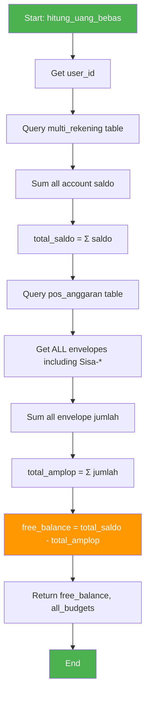
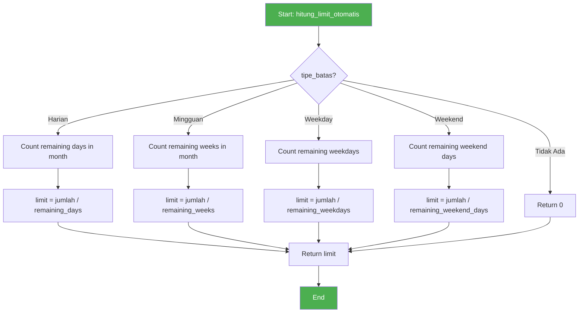
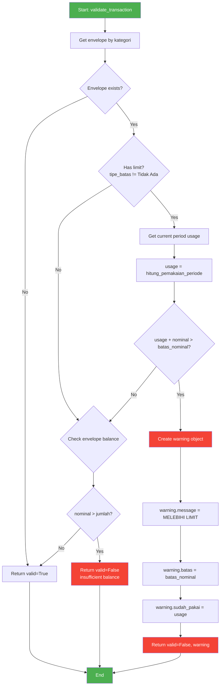
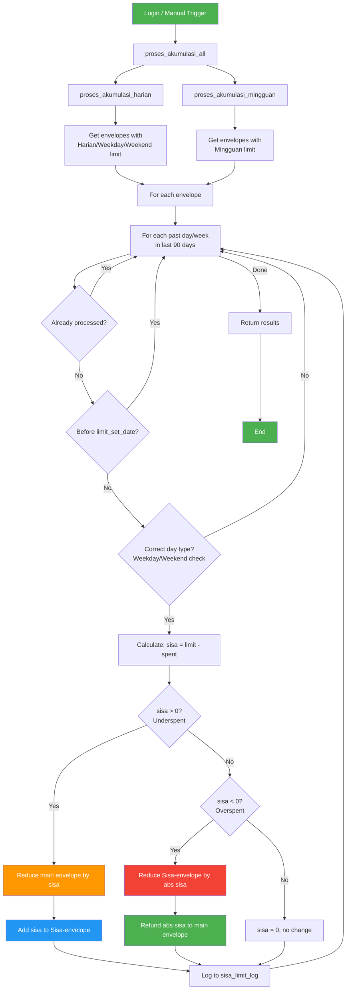
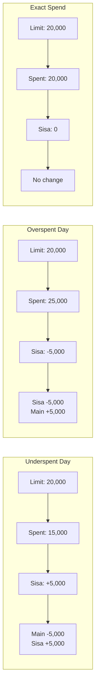
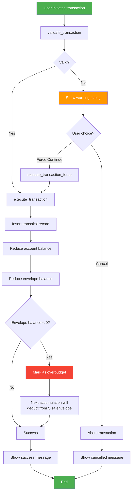

# Business Logic & Algorithms

Core business logic, algorithms, and flowcharts for FATpig application.

---

## Table of Contents

1. [Free Balance Calculation](#1-free-balance-calculation)
2. [Envelope Limit System](#2-envelope-limit-system)
3. [Transaction Validation Flow](#3-transaction-validation-flow)
4. [Sisa Amplop Accumulation](#4-sisa-amplop-accumulation)
5. [Overbudget Handling](#5-overbudget-handling)

---

## 1. Free Balance Calculation

### Concept

**Uang Bebas (Free Balance)** = Total balance across all accounts minus total allocated to all envelopes.

This represents money that hasn't been assigned to any spending category.

### Formula

```
free_balance = sum(all_account_balances) - sum(all_envelope_allocations)
```

### Flowchart



### Implementation

```python
def hitung_uang_bebas(user_id: int) -> tuple[int, list]:
    """
    Calculate unallocated balance.

    Returns:
        tuple: (free_balance, list_of_all_budgets)
    """
    # Get total balance from all accounts
    total_saldo = MultiRekeningService.get_total_saldo(user_id)

    # Get ALL envelopes (including Sisa-* envelopes)
    budgets = BudgetService.get_all(user_id)

    # Sum all allocations
    total_amplop = sum(item['jumlah'] for item in budgets)

    # Free balance = Total - Allocated
    free_balance = total_saldo - total_amplop

    return free_balance, budgets
```

### Important Notes

1. **Sisa Envelopes Included**: The calculation includes `Sisa-*` envelopes. This was a bug fix in v1.2.0.
2. **Can Be Negative**: If over-allocated, free balance will be negative.
3. **Real-time**: Calculated on-demand, not cached.

### Example

```
Accounts:
- Cash: Rp 500,000
- SeaBank: Rp 1,000,000
Total Saldo: Rp 1,500,000

Envelopes:
- Makan: Rp 600,000
- Transport: Rp 300,000
- Sisa-Makan: Rp 50,000
Total Amplop: Rp 950,000

Free Balance: 1,500,000 - 950,000 = Rp 550,000
```

---

## 2. Envelope Limit System

### Concept

Each envelope can have a **spending limit per period**. The system tracks spending and warns when approaching or exceeding limits.

### Limit Types

| Type        | Indonesian | Period  | Description             |
| ----------- | ---------- | ------- | ----------------------- |
| `Tidak Ada` | No Limit   | -       | No spending restriction |
| `Harian`    | Daily      | 1 day   | Resets at midnight      |
| `Mingguan`  | Weekly     | Mon-Sun | Resets on Monday        |
| `Weekday`   | Weekday    | Mon-Fri | Only active Mon-Fri     |
| `Weekend`   | Weekend    | Sat-Sun | Only active Sat-Sun     |

### Auto-Limit Calculation

When creating/updating an envelope with a limit, the system automatically calculates the period limit based on remaining time in month.



### Implementation

```python
def hitung_limit_otomatis(jumlah: int, tipe_batas: str) -> int:
    """
    Calculate automatic period limit based on remaining time.

    Args:
        jumlah: Envelope balance
        tipe_batas: Limit type

    Returns:
        int: Calculated period limit
    """
    if tipe_batas == "Tidak Ada":
        return 0

    today = datetime.now()

    # Get last day of month
    if today.month == 12:
        last_day = datetime(today.year + 1, 1, 1) - timedelta(days=1)
    else:
        last_day = datetime(today.year, today.month + 1, 1) - timedelta(days=1)

    if tipe_batas == "Harian":
        # Days remaining including today
        remaining = (last_day - today).days + 1
        return jumlah // max(remaining, 1)

    elif tipe_batas == "Mingguan":
        # Weeks remaining
        remaining_days = (last_day - today).days + 1
        remaining_weeks = (remaining_days + 6) // 7
        return jumlah // max(remaining_weeks, 1)

    elif tipe_batas == "Weekday":
        # Count weekdays remaining
        remaining = 0
        current = today
        while current <= last_day:
            if current.weekday() < 5:  # Mon-Fri = 0-4
                remaining += 1
            current += timedelta(days=1)
        return jumlah // max(remaining, 1)

    elif tipe_batas == "Weekend":
        # Count weekend days remaining
        remaining = 0
        current = today
        while current <= last_day:
            if current.weekday() >= 5:  # Sat-Sun = 5-6
                remaining += 1
            current += timedelta(days=1)
        return jumlah // max(remaining, 1)

    return 0
```

### Example

```
Today: December 26, 2024 (Thursday)
Days remaining in December: 6 (26, 27, 28, 29, 30, 31)

Envelope "Makan": Rp 120,000

Limit calculations:
- Harian: 120,000 / 6 = Rp 20,000/day
- Mingguan: 120,000 / 1 = Rp 120,000/week
- Weekday: 120,000 / 4 = Rp 30,000/weekday (26, 27, 30, 31)
- Weekend: 120,000 / 2 = Rp 60,000/weekend (28, 29)
```

---

## 3. Transaction Validation Flow

### Concept

Before executing a transaction, the system validates:

1. Period limit (daily/weekly spending cap)
2. Envelope balance (if applicable)

### Flowchart



### Implementation

```python
def validate_transaction(user_id: int, kategori: str, nominal: int) -> dict:
    """
    Validate transaction before execution.

    Returns:
        dict: {"valid": True} or {"valid": False, "warning": {...}}
    """
    # Get envelope
    budget = BudgetService.get_by_kategori(user_id, kategori)

    if not budget:
        return {"valid": True}

    # Check period limit
    if budget['tipe_batas'] != "Tidak Ada":
        # Calculate current usage in this period
        usage = TransaksiService.hitung_pemakaian_periode(
            user_id,
            kategori,
            budget['tipe_batas']
        )

        # Check if exceeds limit
        if usage + nominal > budget['batas_nominal']:
            return {
                "valid": False,
                "warning": {
                    "warning": True,
                    "message": "⚠️ MELEBIHI LIMIT HARI INI!",
                    "batas": budget['batas_nominal'],
                    "sudah_pakai": usage,
                    "periode": get_periode_label(budget['tipe_batas'])
                }
            }

    # Check envelope balance
    if nominal > budget['jumlah']:
        return {
            "valid": False,
            "warning": {
                "warning": True,
                "message": "⚠️ Saldo amplop tidak cukup!",
                "saldo": budget['jumlah'],
                "nominal": nominal
            }
        }

    return {"valid": True}
```

### Period Usage Calculation

```python
def hitung_pemakaian_periode(user_id: int, kategori: str, tipe_batas: str) -> int:
    """
    Calculate spending in current period.
    """
    today = datetime.now().date()

    if tipe_batas == "Harian":
        # Today's transactions
        start = today
        end = today

    elif tipe_batas == "Mingguan":
        # This week (Monday to Sunday)
        start = today - timedelta(days=today.weekday())
        end = start + timedelta(days=6)

    elif tipe_batas == "Weekday":
        # Only if today is weekday
        if today.weekday() >= 5:
            return 0
        start = today
        end = today

    elif tipe_batas == "Weekend":
        # Only if today is weekend
        if today.weekday() < 5:
            return 0
        start = today
        end = today
    else:
        return 0

    # Query transactions in period
    transactions = supabase.table('transaksi')\
        .select('nominal')\
        .eq('user_id', user_id)\
        .eq('kategori', kategori)\
        .gte('created_at', start.isoformat())\
        .lte('created_at', f"{end.isoformat()}T23:59:59")\
        .execute()

    return sum(t['nominal'] for t in transactions.data)
```

---

## 4. Sisa Amplop Accumulation

### Concept

**Sisa Amplop** is the core feature that transfers unused daily/weekly limits to a separate "Sisa-{category}" envelope.

- **Underspent**: Unused limit → transferred to Sisa envelope
- **Overspent**: Excess → deducted from Sisa envelope (refund to main)

### Master Flowchart



### Daily Accumulation Logic



### Implementation

```python
def proses_akumulasi_harian(user_id: int) -> dict:
    """
    Process daily/weekday/weekend accumulation for past 90 days.
    """
    results = {"processed": 0, "skipped": 0, "errors": []}
    today = datetime.now().date()

    # Get envelopes with daily-type limits
    envelopes = get_amplop_with_limit(user_id)
    daily_types = ["Harian", "Weekday", "Weekend"]

    for envelope in envelopes:
        if envelope['tipe_batas'] not in daily_types:
            continue

        kategori = envelope['kategori']
        tipe = envelope['tipe_batas']
        limit = envelope['batas_nominal']
        limit_set_date = envelope.get('limit_set_date')

        # Process each day in last 90 days (excluding today)
        for days_ago in range(1, 91):
            check_date = today - timedelta(days=days_ago)

            # Skip if before limit was set
            if limit_set_date and check_date < limit_set_date.date():
                continue

            # Skip if already processed
            if is_already_processed(user_id, kategori, check_date, tipe):
                results["skipped"] += 1
                continue

            # Check day type matches
            is_weekday = check_date.weekday() < 5
            if tipe == "Weekday" and not is_weekday:
                continue
            if tipe == "Weekend" and is_weekday:
                continue

            # Calculate spending on that day
            total_spent = get_spending_on_date(user_id, kategori, check_date)

            # Calculate remainder
            sisa = limit - total_spent

            # Process based on sisa value
            if sisa > 0:
                # Underspent: transfer to Sisa envelope
                kurangi_amplop_utama(user_id, kategori, sisa)
                transfer_ke_sisa_amplop(user_id, kategori, sisa)
            elif sisa < 0:
                # Overspent: deduct from Sisa, refund to main
                transfer_ke_sisa_amplop(user_id, kategori, sisa)  # negative
                tambah_amplop_utama(user_id, kategori, abs(sisa))

            # Log the accumulation
            log_akumulasi(
                user_id=user_id,
                kategori=kategori,
                tanggal=check_date,
                tipe_limit=tipe,
                batas_harian=limit,
                total_pakai=total_spent,
                sisa=sisa
            )

            results["processed"] += 1

    return results
```

### Weekly Accumulation

Same logic but processes completed weeks (Monday to Sunday):

```python
def proses_akumulasi_mingguan(user_id: int) -> dict:
    """
    Process weekly accumulation for past 4 completed weeks.
    """
    results = {"processed": 0, "skipped": 0}
    today = datetime.now().date()

    # Get envelopes with weekly limit
    envelopes = get_amplop_with_limit(user_id)

    for envelope in envelopes:
        if envelope['tipe_batas'] != "Mingguan":
            continue

        kategori = envelope['kategori']
        limit = envelope['batas_nominal']

        # Process last 4 completed weeks
        for weeks_ago in range(1, 5):
            # Find the Monday of that week
            days_to_monday = today.weekday() + (7 * weeks_ago)
            week_start = today - timedelta(days=days_to_monday)
            week_end = week_start + timedelta(days=6)

            # Skip if current week (not completed)
            if week_end >= today:
                continue

            # Use Monday date as identifier
            if is_already_processed(user_id, kategori, week_start, "Mingguan"):
                continue

            # Calculate week's spending
            total_spent = get_spending_in_range(
                user_id, kategori, week_start, week_end
            )

            sisa = limit - total_spent

            # Same logic as daily
            if sisa > 0:
                kurangi_amplop_utama(user_id, kategori, sisa)
                transfer_ke_sisa_amplop(user_id, kategori, sisa)
            elif sisa < 0:
                transfer_ke_sisa_amplop(user_id, kategori, sisa)
                tambah_amplop_utama(user_id, kategori, abs(sisa))

            log_akumulasi(user_id, kategori, week_start, "Mingguan",
                         limit, total_spent, sisa)
            results["processed"] += 1

    return results
```

### Example Scenario

```
Envelope "Makan":
- Initial Balance: Rp 600,000
- Daily Limit: Rp 20,000

Day 1 (Monday):
- Spent: Rp 15,000
- Sisa: +5,000
- After: Makan = 595,000, Sisa-Makan = 5,000

Day 2 (Tuesday):
- Spent: Rp 25,000
- Sisa: -5,000 (overspent)
- After: Makan = 600,000 (+5k refund), Sisa-Makan = 0 (-5k deducted)

Day 3 (Wednesday):
- Spent: Rp 20,000
- Sisa: 0
- After: No change

Day 4 (Thursday):
- Spent: Rp 10,000
- Sisa: +10,000
- After: Makan = 590,000, Sisa-Makan = 10,000
```

### Key Points

1. **limit_set_date**: Accumulation only starts AFTER this date
2. **Idempotent**: Uses `sisa_limit_log` to prevent duplicate processing
3. **90-day window**: Only processes last 90 days for performance
4. **Runs on login**: `proses_akumulasi_all()` is called after successful login

---

## 5. Overbudget Handling

### Concept

When a transaction exceeds the period limit, the system:

1. Shows warning dialog
2. Allows user to "Force Continue"
3. Records the overspent amount for later refund from Sisa

### Flowchart



### Warning Dialog Structure

```python
warning = {
    "warning": True,
    "message": "⚠️ MELEBIHI LIMIT HARI INI!",
    "batas": 20000,          # Period limit
    "sudah_pakai": 15000,    # Already spent
    "sisa_limit": 5000,      # Remaining limit
    "nominal": 10000,        # Requested amount
    "over_by": 5000,         # Amount over limit
    "periode": "Harian"      # Limit type
}
```

### UI Implementation

```python
def show_overbudget_dialog(page: ft.Page, warning: dict, on_confirm: Callable):
    """
    Show overbudget warning with option to force continue.
    """
    def close_dialog(e):
        dialog.open = False
        page.update()

    def force_continue(e):
        dialog.open = False
        page.update()
        on_confirm()  # Execute transaction anyway

    dialog = ft.AlertDialog(
        modal=True,
        title=ft.Text("⚠️ Peringatan Limit"),
        content=ft.Column([
            ft.Text(warning["message"], weight=ft.FontWeight.BOLD),
            ft.Divider(),
            ft.Text(f"Limit {warning['periode']}: Rp {warning['batas']:,}"),
            ft.Text(f"Sudah dipakai: Rp {warning['sudah_pakai']:,}"),
            ft.Text(f"Sisa limit: Rp {warning.get('sisa_limit', 0):,}"),
            ft.Divider(),
            ft.Text(
                "Lanjutkan akan menggunakan dana dari Sisa Amplop.",
                italic=True,
                size=12
            ),
        ], tight=True),
        actions=[
            ft.TextButton("Batal", on_click=close_dialog),
            ft.ElevatedButton(
                "Lanjutkan Tetap",
                on_click=force_continue,
                bgcolor=ft.Colors.ORANGE_600,
                color=ft.Colors.WHITE,
            ),
        ],
    )

    page.dialog = dialog
    dialog.open = True
    page.update()
```

### Force Execute Flow

```python
def execute_transaction_force(user_id: int, keterangan: str, nominal: int,
                               kategori: str, rekening_id: int = None) -> dict:
    """
    Execute transaction bypassing limit validation.
    Used when user confirms to continue despite overbudget warning.
    """
    # Direct execution without validation
    result = TransaksiService.execute(
        user_id=user_id,
        keterangan=keterangan,
        nominal=nominal,
        kategori=kategori,
        rekening_id=rekening_id
    )

    # The overspent amount will be handled during next accumulation:
    # - proses_akumulasi_harian will detect negative sisa
    # - It will deduct from Sisa-{kategori} envelope
    # - And refund to main envelope (accounting adjustment)

    return result
```

### Refund During Accumulation

When accumulation runs and detects overspending:

```python
# In proses_akumulasi_harian:
sisa = limit - total_spent

if sisa < 0:  # Overspent!
    # Negative transfer = deduct from Sisa envelope
    transfer_ke_sisa_amplop(user_id, kategori, sisa)

    # Refund to main envelope (accounting correction)
    tambah_amplop_utama(user_id, kategori, abs(sisa))
```

### Example

```
Envelope "Transport":
- Balance: Rp 300,000
- Daily Limit: Rp 20,000
- Sisa-Transport: Rp 30,000 (accumulated from previous days)

Transaction: Grab Rp 35,000

1. Validation: 35,000 > 20,000 limit → Warning!
2. User clicks "Lanjutkan Tetap"
3. Execute:
   - Transport: 300,000 - 35,000 = 265,000
   - Account: reduced by 35,000

4. Next day accumulation runs:
   - Spent: 35,000
   - Limit: 20,000
   - Sisa: -15,000 (overspent by 15k)

5. Accumulation adjustment:
   - Sisa-Transport: 30,000 - 15,000 = 15,000
   - Transport: 265,000 + 15,000 = 280,000 (refund)
```

---

## Summary

| Algorithm    | Location                                  | Trigger                            |
| ------------ | ----------------------------------------- | ---------------------------------- |
| Free Balance | `BudgetService.hitung_uang_bebas()`       | Dashboard load, after transactions |
| Auto Limit   | `BudgetService.hitung_limit_otomatis()`   | Envelope create/update             |
| Validation   | `TransaksiService.validate_transaction()` | Before transaction                 |
| Accumulation | `SisaLimitService.proses_akumulasi_all()` | Login, manual trigger              |
| Overbudget   | UI dialog + force execute                 | Transaction over limit             |

---

_Next: [AI_EXPORT_API.md](AI_EXPORT_API.md) - AI service and export documentation_
