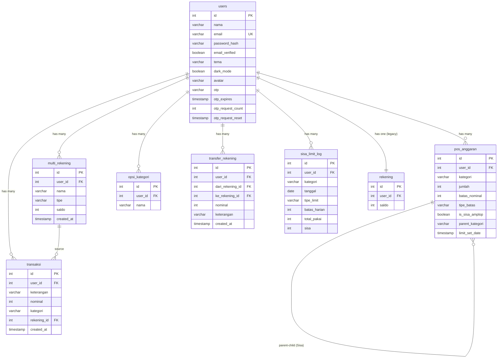

# Database Schema & API Reference

Complete database schema and service API documentation for FATpig application.

---

## Table of Contents

1. [Entity Relationship Diagram](#entity-relationship-diagram)
2. [Table Schemas](#table-schemas)
3. [Service API Reference](#service-api-reference)

---

## Entity Relationship Diagram



---

## Table Schemas

### 1. `users` - User Accounts

| Column              | Type         | Constraints      | Description                    |
| ------------------- | ------------ | ---------------- | ------------------------------ |
| `id`                | SERIAL       | PRIMARY KEY      | Auto-increment user ID         |
| `nama`              | VARCHAR(100) | NOT NULL         | Display name                   |
| `email`             | VARCHAR(255) | UNIQUE, NOT NULL | Email address                  |
| `password_hash`     | VARCHAR(255) | NULL             | bcrypt hashed password         |
| `email_verified`    | BOOLEAN      | DEFAULT false    | Email verification status      |
| `tema`              | VARCHAR(20)  | DEFAULT 'ungu'   | Theme: ungu, hijau, biru, pink |
| `dark_mode`         | BOOLEAN      | DEFAULT false    | Dark mode preference           |
| `avatar`            | VARCHAR(10)  | DEFAULT '🐷'     | Emoji avatar                   |
| `otp`               | VARCHAR(6)   | NULL             | Current OTP code               |
| `otp_expires`       | TIMESTAMP    | NULL             | OTP expiry time                |
| `otp_request_count` | INT          | DEFAULT 0        | Rate limit counter             |
| `otp_request_reset` | TIMESTAMP    | NULL             | Rate limit reset time          |

### 2. `rekening` - Legacy Balance (Deprecated)

| Column    | Type   | Constraints   | Description            |
| --------- | ------ | ------------- | ---------------------- |
| `id`      | SERIAL | PRIMARY KEY   |                        |
| `user_id` | INT    | FK → users.id |                        |
| `saldo`   | INT    | DEFAULT 0     | Total balance (legacy) |

### 3. `multi_rekening` - Payment Accounts

| Column       | Type        | Constraints   | Description                        |
| ------------ | ----------- | ------------- | ---------------------------------- |
| `id`         | SERIAL      | PRIMARY KEY   |                                    |
| `user_id`    | INT         | FK → users.id |                                    |
| `nama`       | VARCHAR(50) | NOT NULL      | Account name (Cash, SeaBank, etc.) |
| `tipe`       | VARCHAR(20) | NOT NULL      | Type: cash, bank, ewallet          |
| `saldo`      | INT         | DEFAULT 0     | Account balance                    |
| `created_at` | TIMESTAMP   | DEFAULT now() |                                    |

### 4. `pos_anggaran` - Budget Envelopes

| Column            | Type        | Constraints         | Description               |
| ----------------- | ----------- | ------------------- | ------------------------- |
| `id`              | SERIAL      | PRIMARY KEY         |                           |
| `user_id`         | INT         | FK → users.id       |                           |
| `kategori`        | VARCHAR(50) | NOT NULL            | Category name             |
| `jumlah`          | INT         | DEFAULT 0           | Allocated amount          |
| `batas_nominal`   | INT         | DEFAULT 0           | Period limit              |
| `tipe_batas`      | VARCHAR(20) | DEFAULT 'Tidak Ada' | Limit type                |
| `is_sisa_amplop`  | BOOLEAN     | DEFAULT false       | Is Sisa-envelope          |
| `parent_kategori` | VARCHAR(50) | NULL                | Parent for Sisa-envelopes |
| `limit_set_date`  | TIMESTAMP   | NULL                | When limit was first set  |

**Limit Types (`tipe_batas`):**

- `"Tidak Ada"` - No limit
- `"Harian"` - Daily limit
- `"Mingguan"` - Weekly limit (Mon-Sun)
- `"Weekday"` - Weekday only (Mon-Fri)
- `"Weekend"` - Weekend only (Sat-Sun)

### 5. `transaksi` - Transactions

| Column        | Type         | Constraints                  | Description                 |
| ------------- | ------------ | ---------------------------- | --------------------------- |
| `id`          | SERIAL       | PRIMARY KEY                  |                             |
| `user_id`     | INT          | FK → users.id                |                             |
| `keterangan`  | VARCHAR(255) | NOT NULL                     | Description                 |
| `nominal`     | INT          | NOT NULL                     | Amount (positive = expense) |
| `kategori`    | VARCHAR(50)  | NOT NULL                     | Category name               |
| `rekening_id` | INT          | FK → multi_rekening.id, NULL | Source account              |
| `created_at`  | TIMESTAMP    | DEFAULT now()                |                             |

### 6. `opsi_kategori` - Custom Categories

| Column    | Type        | Constraints   | Description   |
| --------- | ----------- | ------------- | ------------- |
| `id`      | SERIAL      | PRIMARY KEY   |               |
| `user_id` | INT         | FK → users.id |               |
| `nama`    | VARCHAR(50) | NOT NULL      | Category name |

### 7. `transfer_rekening` - Account Transfers

| Column             | Type         | Constraints            | Description         |
| ------------------ | ------------ | ---------------------- | ------------------- |
| `id`               | SERIAL       | PRIMARY KEY            |                     |
| `user_id`          | INT          | FK → users.id          |                     |
| `dari_rekening_id` | INT          | FK → multi_rekening.id | Source account      |
| `ke_rekening_id`   | INT          | FK → multi_rekening.id | Destination account |
| `nominal`          | INT          | NOT NULL               | Transfer amount     |
| `keterangan`       | VARCHAR(255) | NULL                   | Note                |
| `created_at`       | TIMESTAMP    | DEFAULT now()          |                     |

### 8. `sisa_limit_log` - Accumulation Log

| Column         | Type        | Constraints   | Description               |
| -------------- | ----------- | ------------- | ------------------------- |
| `id`           | SERIAL      | PRIMARY KEY   |                           |
| `user_id`      | INT         | FK → users.id |                           |
| `kategori`     | VARCHAR(50) | NOT NULL      | Category name             |
| `tanggal`      | DATE        | NOT NULL      | Date processed            |
| `tipe_limit`   | VARCHAR(20) | NOT NULL      | Limit type                |
| `batas_harian` | INT         | NOT NULL      | Period limit value        |
| `total_pakai`  | INT         | NOT NULL      | Total spent that period   |
| `sisa`         | INT         | NOT NULL      | Remainder (limit - spent) |

---

## Service API Reference

### UserService

User authentication and profile management.

```python
class UserService:
    """
    Manages user accounts, authentication, and OTP verification.
    Location: database.py
    """
```

#### Methods

##### `get_all_users`

```python
@staticmethod
def get_all_users() -> list[dict]:
    """
    Get all users from database.

    @returns {list[dict]} List of user records

    @example
    users = UserService.get_all_users()
    # [{"id": 1, "nama": "John", "email": "john@example.com", ...}, ...]
    """
```

##### `create_user`

```python
@staticmethod
def create_user(nama: str) -> dict | None:
    """
    Create new user with default setup (legacy, no password).

    @param {str} nama - Display name
    @returns {dict|None} Created user record or None on failure

    @sideeffects
    - Creates default rekening with 0 balance
    - Creates default categories: Makan, Transport, Belanja, Hiburan, Lainnya

    @example
    user = UserService.create_user("Fathin")
    # {"id": 1, "nama": "Fathin", "tema": "ungu", ...}
    """
```

##### `register_with_email`

```python
@staticmethod
def register_with_email(nama: str, email: str, password: str) -> dict:
    """
    Register new user with email and password.

    @param {str} nama - Display name
    @param {str} email - Email address
    @param {str} password - Plain text password (will be hashed)
    @returns {dict} Result with success status

    @returns_format
    Success: {"success": True, "user_id": int, "message": str}
    Failure: {"success": False, "message": str}

    @sideeffects
    - Hashes password with bcrypt
    - Creates default rekening
    - Creates default categories
    - Sets email_verified = False

    @example
    result = UserService.register_with_email("Fathin", "fathin@email.com", "secret123")
    if result["success"]:
        user_id = result["user_id"]
    """
```

##### `login_with_password`

```python
@staticmethod
def login_with_password(email: str, password: str) -> dict:
    """
    Authenticate user with email and password.

    @param {str} email - Email address
    @param {str} password - Plain text password
    @returns {dict} Result with user data on success

    @returns_format
    Success: {"success": True, "user": dict}
    Failure: {"success": False, "message": str}

    @example
    result = UserService.login_with_password("fathin@email.com", "secret123")
    if result["success"]:
        user = result["user"]
        print(f"Welcome {user['nama']}")
    """
```

##### `get_user_by_id`

```python
@staticmethod
def get_user_by_id(user_id: int) -> dict | None:
    """
    Get user by ID.

    @param {int} user_id - User ID
    @returns {dict|None} User record or None if not found
    """
```

##### `get_user_by_email`

```python
@staticmethod
def get_user_by_email(email: str) -> dict | None:
    """
    Find user by email address.

    @param {str} email - Email address
    @returns {dict|None} User record or None if not found
    """
```

##### `get_tema`

```python
@staticmethod
def get_tema(user_id: int) -> str:
    """
    Get user's color theme preference.

    @param {int} user_id - User ID
    @returns {str} Theme ID (default: "ungu")
    """
```

##### `set_tema`

```python
@staticmethod
def set_tema(user_id: int, tema: str) -> bool:
    """
    Update user's color theme.

    @param {int} user_id - User ID
    @param {str} tema - Theme ID: "ungu", "hijau", "biru", "pink"
    @returns {bool} Success status
    """
```

##### `get_dark_mode`

```python
@staticmethod
def get_dark_mode(user_id: int) -> bool:
    """
    Get user's dark mode preference.

    @param {int} user_id - User ID
    @returns {bool} Dark mode enabled
    """
```

##### `set_dark_mode`

```python
@staticmethod
def set_dark_mode(user_id: int, dark_mode: bool) -> bool:
    """
    Update user's dark mode preference.

    @param {int} user_id - User ID
    @param {bool} dark_mode - Enable dark mode
    @returns {bool} Success status
    """
```

##### `update_avatar`

```python
@staticmethod
def update_avatar(user_id: int, avatar: str) -> bool:
    """
    Update user's emoji avatar.

    @param {int} user_id - User ID
    @param {str} avatar - Emoji character
    @returns {bool} Success status
    """
```

##### `update_nama`

```python
@staticmethod
def update_nama(user_id: int, nama: str) -> bool:
    """
    Update user's display name.

    @param {int} user_id - User ID
    @param {str} nama - New display name
    @returns {bool} Success status
    """
```

##### `save_otp`

```python
@staticmethod
def save_otp(user_id: int, otp: str, expires_minutes: int = 10) -> bool:
    """
    Save OTP code for user verification.

    @param {int} user_id - User ID
    @param {str} otp - 6-digit OTP code
    @param {int} expires_minutes - OTP validity in minutes (default: 10)
    @returns {bool} Success status
    """
```

##### `verify_otp`

```python
@staticmethod
def verify_otp(user_id: int, otp: str) -> dict:
    """
    Verify OTP code.

    @param {int} user_id - User ID
    @param {str} otp - OTP code to verify
    @returns {dict} Verification result

    @returns_format
    Success: {"success": True}
    Failure: {"success": False, "message": "OTP salah/kadaluarsa"}
    """
```

##### `check_otp_rate_limit`

```python
@staticmethod
def check_otp_rate_limit(user_id: int) -> dict:
    """
    Check if user can request new OTP (rate limiting).

    @param {int} user_id - User ID
    @returns {dict} Rate limit status

    @returns_format
    Allowed: {"allowed": True}
    Blocked: {"allowed": False, "message": str, "retry_after": int}

    @note Max 3 requests per 30-minute window
    """
```

##### `mark_email_verified`

```python
@staticmethod
def mark_email_verified(user_id: int) -> bool:
    """
    Mark user's email as verified.

    @param {int} user_id - User ID
    @returns {bool} Success status
    """
```

##### `reset_password`

```python
@staticmethod
def reset_password(user_id: int, new_password: str) -> dict:
    """
    Reset user password after OTP verification.

    @param {int} user_id - User ID
    @param {str} new_password - New plain text password
    @returns {dict} Result with success status
    """
```

---

### MultiRekeningService

Multi-account management (Cash, Bank, E-Wallet).

```python
class MultiRekeningService:
    """
    Manages multiple payment accounts per user.
    Location: database.py
    """
```

#### Methods

##### `get_all`

```python
@staticmethod
def get_all(user_id: int) -> list[dict]:
    """
    Get all accounts for user.

    @param {int} user_id - User ID
    @returns {list[dict]} List of account records

    @example
    accounts = MultiRekeningService.get_all(user_id)
    # [{"id": 1, "nama": "Cash", "tipe": "cash", "saldo": 500000}, ...]
    """
```

##### `get_by_id`

```python
@staticmethod
def get_by_id(rekening_id: int) -> dict | None:
    """
    Get account by ID.

    @param {int} rekening_id - Account ID
    @returns {dict|None} Account record or None
    """
```

##### `get_total_saldo`

```python
@staticmethod
def get_total_saldo(user_id: int) -> int:
    """
    Calculate total balance across all accounts.

    @param {int} user_id - User ID
    @returns {int} Total balance in Rupiah

    @example
    total = MultiRekeningService.get_total_saldo(user_id)
    # 1500000
    """
```

##### `create`

```python
@staticmethod
def create(user_id: int, nama: str, tipe: str, saldo: int = 0) -> dict | None:
    """
    Create new account.

    @param {int} user_id - User ID
    @param {str} nama - Account name
    @param {str} tipe - Type: "cash", "bank", "ewallet"
    @param {int} saldo - Initial balance (default: 0)
    @returns {dict|None} Created account or None on failure

    @sideeffects Updates legacy rekening.saldo
    """
```

##### `update`

```python
@staticmethod
def update(rekening_id: int, nama: str, tipe: str) -> bool:
    """
    Update account name and type.

    @param {int} rekening_id - Account ID
    @param {str} nama - New name
    @param {str} tipe - New type
    @returns {bool} Success status
    """
```

##### `delete`

```python
@staticmethod
def delete(rekening_id: int) -> dict:
    """
    Delete account (must have 0 balance).

    @param {int} rekening_id - Account ID
    @returns {dict} Result with success status

    @returns_format
    Success: {"success": True}
    Failure: {"success": False, "message": "Saldo harus 0"}
    """
```

##### `update_saldo`

```python
@staticmethod
def update_saldo(rekening_id: int, new_saldo: int) -> bool:
    """
    Set account balance to specific value.

    @param {int} rekening_id - Account ID
    @param {int} new_saldo - New balance value
    @returns {bool} Success status
    """
```

##### `tambah_saldo`

```python
@staticmethod
def tambah_saldo(rekening_id: int, jumlah: int) -> bool:
    """
    Add to account balance.

    @param {int} rekening_id - Account ID
    @param {int} jumlah - Amount to add
    @returns {bool} Success status
    """
```

##### `kurangi_saldo`

```python
@staticmethod
def kurangi_saldo(rekening_id: int, jumlah: int) -> bool:
    """
    Subtract from account balance.

    @param {int} rekening_id - Account ID
    @param {int} jumlah - Amount to subtract
    @returns {bool} Success status
    """
```

##### `transfer`

```python
@staticmethod
def transfer(user_id: int, dari_id: int, ke_id: int, nominal: int, keterangan: str = "") -> dict:
    """
    Transfer between accounts.

    @param {int} user_id - User ID
    @param {int} dari_id - Source account ID
    @param {int} ke_id - Destination account ID
    @param {int} nominal - Transfer amount
    @param {str} keterangan - Optional note
    @returns {dict} Result with success status

    @sideeffects
    - Reduces source account balance
    - Increases destination account balance
    - Creates transfer_rekening record
    """
```

##### `get_transfer_history`

```python
@staticmethod
def get_transfer_history(user_id: int, limit: int = 50) -> list[dict]:
    """
    Get account transfer history.

    @param {int} user_id - User ID
    @param {int} limit - Max records (default: 50)
    @returns {list[dict]} Transfer records
    """
```

##### `setup_default`

```python
@staticmethod
def setup_default(user_id: int) -> None:
    """
    Create default Cash account for new user.

    @param {int} user_id - User ID
    @sideeffects Creates "Cash" account with 0 balance
    """
```

---

### BudgetService

Envelope budgeting with limit features.

```python
class BudgetService:
    """
    Manages budget envelopes (amplop) with spending limits.
    Location: database.py
    """
```

#### Methods

##### `get_all`

```python
@staticmethod
def get_all(user_id: int) -> list[dict]:
    """
    Get all budget envelopes for user.

    @param {int} user_id - User ID
    @returns {list[dict]} List of envelope records

    @example
    budgets = BudgetService.get_all(user_id)
    # [{"id": 1, "kategori": "Makan", "jumlah": 500000, "batas_nominal": 20000, ...}, ...]
    """
```

##### `get_by_kategori`

```python
@staticmethod
def get_by_kategori(user_id: int, kategori: str) -> dict | None:
    """
    Get budget by category name.

    @param {int} user_id - User ID
    @param {str} kategori - Category name
    @returns {dict|None} Budget record or None
    """
```

##### `hitung_uang_bebas`

```python
@staticmethod
def hitung_uang_bebas(user_id: int) -> tuple[int, list]:
    """
    Calculate free (unallocated) balance.

    @param {int} user_id - User ID
    @returns {tuple} (free_balance: int, all_budgets: list)

    @formula free_balance = total_saldo - sum(all_envelope_jumlah)

    @note Includes Sisa-envelopes in calculation

    @example
    free, budgets = BudgetService.hitung_uang_bebas(user_id)
    print(f"Uang Bebas: Rp {free:,}")
    """
```

##### `hitung_limit_otomatis`

```python
@staticmethod
def hitung_limit_otomatis(jumlah: int, tipe_batas: str) -> int:
    """
    Calculate automatic period limit based on remaining time in month.

    @param {int} jumlah - Envelope balance
    @param {str} tipe_batas - Limit type
    @returns {int} Calculated period limit

    @formula
    - Harian: jumlah // remaining_days_in_month
    - Mingguan: jumlah // remaining_weeks_in_month
    - Weekday: jumlah // remaining_weekdays
    - Weekend: jumlah // remaining_weekend_days

    @example
    # If today is Dec 26, 5 days left in month
    limit = BudgetService.hitung_limit_otomatis(100000, "Harian")
    # Returns: 20000 (100000 / 5)
    """
```

##### `upsert`

```python
@staticmethod
def upsert(user_id: int, kategori: str, jumlah: int, tipe_batas: str = "Tidak Ada") -> None:
    """
    Insert or update budget envelope with auto-calculated limit.

    @param {int} user_id - User ID
    @param {str} kategori - Category name
    @param {int} jumlah - Allocation amount
    @param {str} tipe_batas - Limit type

    @sideeffects
    - Sets batas_nominal via hitung_limit_otomatis()
    - Sets limit_set_date on first limit activation

    @example
    BudgetService.upsert(user_id, "Makan", 600000, "Harian")
    """
```

##### `delete`

```python
@staticmethod
def delete(user_id: int, kategori: str) -> bool:
    """
    Delete budget envelope.

    @param {int} user_id - User ID
    @param {str} kategori - Category name
    @returns {bool} Success status
    """
```

##### `kurangi_budget`

```python
@staticmethod
def kurangi_budget(user_id: int, kategori: str, jumlah_potong: int) -> None:
    """
    Reduce budget amount after transaction.

    @param {int} user_id - User ID
    @param {str} kategori - Category name
    @param {int} jumlah_potong - Amount to reduce

    @sideeffects Updates pos_anggaran.jumlah
    """
```

##### `check_limit`

```python
@staticmethod
def check_limit(user_id: int, kategori: str, nominal: int) -> dict | None:
    """
    Check if transaction exceeds period limit.

    @param {int} user_id - User ID
    @param {str} kategori - Category name
    @param {int} nominal - Transaction amount
    @returns {dict|None} Warning if over limit, None if OK

    @returns_format
    Over limit: {
        "warning": True,
        "message": "⚠️ MELEBIHI LIMIT HARI INI!",
        "batas": int,
        "sudah_pakai": int,
        "periode": str
    }

    @example
    warning = BudgetService.check_limit(user_id, "Makan", 50000)
    if warning:
        show_warning_dialog(warning["message"])
    """
```

---

### TransaksiService

Transaction management and reporting.

```python
class TransaksiService:
    """
    Manages transactions and generates reports.
    Location: database.py
    """
```

#### Methods

##### `insert`

```python
@staticmethod
def insert(user_id: int, keterangan: str, nominal: int, kategori: str, rekening_id: int = None) -> dict | None:
    """
    Insert new transaction record.

    @param {int} user_id - User ID
    @param {str} keterangan - Description
    @param {int} nominal - Amount
    @param {str} kategori - Category name
    @param {int} rekening_id - Account ID (optional)
    @returns {dict|None} Created transaction or None
    """
```

##### `execute`

```python
@staticmethod
def execute(user_id: int, keterangan: str, nominal: int, kategori: str, rekening_id: int = None) -> dict:
    """
    Execute expense transaction with all side effects.

    @param {int} user_id - User ID
    @param {str} keterangan - Description
    @param {int} nominal - Amount
    @param {str} kategori - Category name
    @param {int} rekening_id - Account ID (optional)
    @returns {dict} Result with success status

    @sideeffects
    - Inserts transaksi record
    - Reduces account balance (if rekening_id provided)
    - Reduces budget envelope balance
    - Updates legacy rekening.saldo

    @example
    result = TransaksiService.execute(
        user_id=1,
        keterangan="Makan siang warteg",
        nominal=25000,
        kategori="Makan",
        rekening_id=1
    )
    """
```

##### `validate_transaction`

```python
@staticmethod
def validate_transaction(user_id: int, kategori: str, nominal: int) -> dict:
    """
    Validate transaction before execution.

    @param {int} user_id - User ID
    @param {str} kategori - Category name
    @param {int} nominal - Amount
    @returns {dict} Validation result

    @returns_format
    Valid: {"valid": True}
    Invalid: {"valid": False, "warning": dict}
    """
```

##### `search`

```python
@staticmethod
def search(user_id: int, keyword: str = "", kategori: str = "",
           start_date: str = None, end_date: str = None, limit: int = 100) -> list[dict]:
    """
    Search and filter transactions.

    @param {int} user_id - User ID
    @param {str} keyword - Search in keterangan
    @param {str} kategori - Filter by category
    @param {str} start_date - Start date (YYYY-MM-DD)
    @param {str} end_date - End date (YYYY-MM-DD)
    @param {int} limit - Max records
    @returns {list[dict]} Matching transactions
    """
```

##### `get_recent`

```python
@staticmethod
def get_recent(user_id: int, limit: int = 10) -> list[dict]:
    """
    Get recent transactions.

    @param {int} user_id - User ID
    @param {int} limit - Number of transactions
    @returns {list[dict]} Recent transactions (newest first)
    """
```

##### `get_by_kategori`

```python
@staticmethod
def get_by_kategori(user_id: int, kategori: str, limit: int = 50) -> list[dict]:
    """
    Get transactions by category.

    @param {int} user_id - User ID
    @param {str} kategori - Category name
    @param {int} limit - Max records
    @returns {list[dict]} Transactions in category
    """
```

##### `hitung_pemakaian_periode`

```python
@staticmethod
def hitung_pemakaian_periode(user_id: int, kategori: str, tipe_batas: str) -> int:
    """
    Calculate usage within current period.

    @param {int} user_id - User ID
    @param {str} kategori - Category name
    @param {str} tipe_batas - Period type
    @returns {int} Total spent in current period

    @periods
    - Harian: Today
    - Mingguan: This week (Mon-Sun)
    - Weekday: Today (if weekday)
    - Weekend: Today (if weekend)
    """
```

##### `get_spending_by_category`

```python
@staticmethod
def get_spending_by_category(user_id: int, start_date: str = None, end_date: str = None) -> list[dict]:
    """
    Get spending totals grouped by category.

    @param {int} user_id - User ID
    @param {str} start_date - Start date (optional)
    @param {str} end_date - End date (optional)
    @returns {list[dict]} Category spending totals

    @example
    spending = TransaksiService.get_spending_by_category(user_id)
    # [{"kategori": "Makan", "total": 350000}, {"kategori": "Transport", "total": 150000}]
    """
```

##### `get_export_data`

```python
@staticmethod
def get_export_data(user_id: int, start_date: str, end_date: str) -> dict:
    """
    Get complete data for PDF/Excel export.

    @param {int} user_id - User ID
    @param {str} start_date - Start date (YYYY-MM-DD)
    @param {str} end_date - End date (YYYY-MM-DD)
    @returns {dict} Export data package

    @returns_format
    {
        "transactions": list[dict],
        "summary": {"total": int, "count": int},
        "by_category": list[dict],
        "period": {"start": str, "end": str}
    }
    """
```

---

### KategoriService

Category management.

```python
class KategoriService:
    """
    Manages spending categories.
    Location: database.py
    """
```

#### Methods

##### `get_all`

```python
@staticmethod
def get_all(user_id: int) -> list[str]:
    """
    Get all category names for user.

    @param {int} user_id - User ID
    @returns {list[str]} Category names

    @example
    categories = KategoriService.get_all(user_id)
    # ["Makan", "Transport", "Belanja", "Hiburan", "Lainnya"]
    """
```

##### `add`

```python
@staticmethod
def add(user_id: int, nama: str) -> bool:
    """
    Add new category.

    @param {int} user_id - User ID
    @param {str} nama - Category name
    @returns {bool} Success status
    """
```

##### `delete`

```python
@staticmethod
def delete(user_id: int, nama: str) -> bool:
    """
    Delete category.

    @param {int} user_id - User ID
    @param {str} nama - Category name
    @returns {bool} Success status
    """
```

---

### SisaLimitService

Daily/weekly limit accumulation to "Sisa" envelopes.

```python
class SisaLimitService:
    """
    Manages limit accumulation to Sisa-{category} envelopes.
    Location: database.py
    """
```

#### Methods

##### `get_amplop_with_limit`

```python
@staticmethod
def get_amplop_with_limit(user_id: int) -> list[dict]:
    """
    Get envelopes with active limits (excluding Sisa-envelopes).

    @param {int} user_id - User ID
    @returns {list[dict]} Envelopes with tipe_batas != "Tidak Ada"
    """
```

##### `is_already_processed`

```python
@staticmethod
def is_already_processed(user_id: int, kategori: str, tanggal: str, tipe_limit: str) -> bool:
    """
    Check if date already processed in accumulation.

    @param {int} user_id - User ID
    @param {str} kategori - Category name
    @param {str} tanggal - Date (YYYY-MM-DD)
    @param {str} tipe_limit - Limit type
    @returns {bool} True if already logged
    """
```

##### `log_akumulasi`

```python
@staticmethod
def log_akumulasi(user_id: int, kategori: str, tanggal: str, tipe_limit: str,
                  batas_harian: int, total_pakai: int, sisa: int) -> None:
    """
    Log accumulation record to prevent duplicate processing.

    @param {int} user_id - User ID
    @param {str} kategori - Category name
    @param {str} tanggal - Date (YYYY-MM-DD)
    @param {str} tipe_limit - Limit type
    @param {int} batas_harian - Period limit
    @param {int} total_pakai - Total spent
    @param {int} sisa - Remainder
    """
```

##### `get_or_create_sisa_amplop`

```python
@staticmethod
def get_or_create_sisa_amplop(user_id: int, parent_kategori: str) -> dict:
    """
    Get or create "Sisa-{category}" envelope.

    @param {int} user_id - User ID
    @param {str} parent_kategori - Parent category name
    @returns {dict} Sisa envelope record

    @sideeffects Creates envelope if not exists with:
    - kategori: "Sisa-{parent_kategori}"
    - is_sisa_amplop: True
    - parent_kategori: parent_kategori
    - jumlah: 0
    """
```

##### `transfer_ke_sisa_amplop`

```python
@staticmethod
def transfer_ke_sisa_amplop(user_id: int, parent_kategori: str, nominal: int) -> None:
    """
    Transfer amount to Sisa envelope.

    @param {int} user_id - User ID
    @param {str} parent_kategori - Parent category name
    @param {int} nominal - Amount (can be negative for refund)

    @logic
    - If nominal > 0: Add to Sisa envelope
    - If nominal < 0: Reduce from Sisa envelope
    """
```

##### `kurangi_amplop_utama`

```python
@staticmethod
def kurangi_amplop_utama(user_id: int, kategori: str, nominal: int) -> None:
    """
    Reduce main envelope balance.

    @param {int} user_id - User ID
    @param {str} kategori - Category name
    @param {int} nominal - Amount to reduce
    """
```

##### `proses_akumulasi_harian`

```python
@staticmethod
def proses_akumulasi_harian(user_id: int) -> dict:
    """
    Process daily/weekday/weekend accumulation.

    @param {int} user_id - User ID
    @returns {dict} Processing result

    @logic
    For each day in last 90 days (excluding today):
    1. Skip if: wrong day type, before limit_set_date, already processed
    2. Calculate: sisa = batas_nominal - total_spent
    3. If sisa > 0 (underspent):
       - Reduce main envelope by sisa
       - Add sisa to Sisa-{kategori}
    4. If sisa < 0 (overspent):
       - Reduce Sisa-{kategori} by abs(sisa)
       - Refund abs(sisa) to main envelope
    5. Log to sisa_limit_log
    """
```

##### `proses_akumulasi_mingguan`

```python
@staticmethod
def proses_akumulasi_mingguan(user_id: int) -> dict:
    """
    Process weekly accumulation.

    @param {int} user_id - User ID
    @returns {dict} Processing result

    @logic Same as harian but for completed weeks (Mon-Sun)
    """
```

##### `proses_akumulasi_all`

```python
@staticmethod
def proses_akumulasi_all(user_id: int) -> dict:
    """
    Process all pending accumulations (called on login).

    @param {int} user_id - User ID
    @returns {dict} Combined results from harian + mingguan

    @example
    # Called after successful login
    result = SisaLimitService.proses_akumulasi_all(user_id)
    print(f"Processed: {result}")
    """
```

##### `adjust_data_lama`

```python
@staticmethod
def adjust_data_lama(user_id: int) -> dict:
    """
    Migration: Adjust old data for Sisa Amplop logic fix.

    @param {int} user_id - User ID
    @returns {dict} Migration result

    @note Run once for users created before v1.2.0
    """
```

##### `get_total_sisa`

```python
@staticmethod
def get_total_sisa(user_id: int, parent_kategori: str) -> int:
    """
    Get total accumulated in Sisa envelope.

    @param {int} user_id - User ID
    @param {str} parent_kategori - Parent category name
    @returns {int} Total in Sisa-{parent_kategori}
    """
```

##### `get_history`

```python
@staticmethod
def get_history(user_id: int, kategori: str = None, limit: int = 30) -> list[dict]:
    """
    Get accumulation history.

    @param {int} user_id - User ID
    @param {str} kategori - Filter by category (optional)
    @param {int} limit - Max records
    @returns {list[dict]} Accumulation log records
    """
```

---

### BackupService

Data backup and restore.

```python
class BackupService:
    """
    Manages backup and restore of user data.
    Location: database.py
    """
```

#### Methods

##### `create_backup`

```python
@staticmethod
def create_backup(user_id: int) -> dict:
    """
    Create complete backup of all user data.

    @param {int} user_id - User ID
    @returns {dict} Complete backup data

    @returns_format
    {
        "version": "1.0",
        "created_at": "ISO datetime",
        "user": dict,
        "rekening": list,
        "budgets": list,
        "transactions": list,
        "categories": list,
        "transfers": list
    }
    """
```

##### `validate_backup`

```python
@staticmethod
def validate_backup(backup_data: dict) -> dict:
    """
    Validate backup format and integrity.

    @param {dict} backup_data - Backup data to validate
    @returns {dict} Validation result

    @returns_format
    Valid: {"valid": True}
    Invalid: {"valid": False, "errors": list[str]}
    """
```

##### `restore_backup`

```python
@staticmethod
def restore_backup(user_id: int, backup_data: dict) -> dict:
    """
    Restore data from backup (FULL REPLACE).

    @param {int} user_id - User ID
    @param {dict} backup_data - Validated backup data
    @returns {dict} Restore result

    @warning This DELETES all existing data before restore
    """
```

---

## SQL Table Creation

```sql
-- Users table
CREATE TABLE users (
    id SERIAL PRIMARY KEY,
    nama VARCHAR(100) NOT NULL,
    email VARCHAR(255) UNIQUE NOT NULL,
    password_hash VARCHAR(255),
    email_verified BOOLEAN DEFAULT FALSE,
    tema VARCHAR(20) DEFAULT 'ungu',
    dark_mode BOOLEAN DEFAULT FALSE,
    avatar VARCHAR(10) DEFAULT '🐷',
    otp VARCHAR(6),
    otp_expires TIMESTAMP,
    otp_request_count INT DEFAULT 0,
    otp_request_reset TIMESTAMP
);

-- Legacy balance (deprecated)
CREATE TABLE rekening (
    id SERIAL PRIMARY KEY,
    user_id INT REFERENCES users(id),
    saldo INT DEFAULT 0
);

-- Multi-account
CREATE TABLE multi_rekening (
    id SERIAL PRIMARY KEY,
    user_id INT REFERENCES users(id),
    nama VARCHAR(50) NOT NULL,
    tipe VARCHAR(20) NOT NULL,
    saldo INT DEFAULT 0,
    created_at TIMESTAMP DEFAULT NOW()
);

-- Budget envelopes
CREATE TABLE pos_anggaran (
    id SERIAL PRIMARY KEY,
    user_id INT REFERENCES users(id),
    kategori VARCHAR(50) NOT NULL,
    jumlah INT DEFAULT 0,
    batas_nominal INT DEFAULT 0,
    tipe_batas VARCHAR(20) DEFAULT 'Tidak Ada',
    is_sisa_amplop BOOLEAN DEFAULT FALSE,
    parent_kategori VARCHAR(50),
    limit_set_date TIMESTAMP
);

-- Transactions
CREATE TABLE transaksi (
    id SERIAL PRIMARY KEY,
    user_id INT REFERENCES users(id),
    keterangan VARCHAR(255) NOT NULL,
    nominal INT NOT NULL,
    kategori VARCHAR(50) NOT NULL,
    rekening_id INT REFERENCES multi_rekening(id),
    created_at TIMESTAMP DEFAULT NOW()
);

-- Categories
CREATE TABLE opsi_kategori (
    id SERIAL PRIMARY KEY,
    user_id INT REFERENCES users(id),
    nama VARCHAR(50) NOT NULL
);

-- Transfer history
CREATE TABLE transfer_rekening (
    id SERIAL PRIMARY KEY,
    user_id INT REFERENCES users(id),
    dari_rekening_id INT REFERENCES multi_rekening(id),
    ke_rekening_id INT REFERENCES multi_rekening(id),
    nominal INT NOT NULL,
    keterangan VARCHAR(255),
    created_at TIMESTAMP DEFAULT NOW()
);

-- Accumulation log
CREATE TABLE sisa_limit_log (
    id SERIAL PRIMARY KEY,
    user_id INT REFERENCES users(id),
    kategori VARCHAR(50) NOT NULL,
    tanggal DATE NOT NULL,
    tipe_limit VARCHAR(20) NOT NULL,
    batas_harian INT NOT NULL,
    total_pakai INT NOT NULL,
    sisa INT NOT NULL
);

-- Indexes for performance
CREATE INDEX idx_transaksi_user_date ON transaksi(user_id, created_at DESC);
CREATE INDEX idx_pos_anggaran_user ON pos_anggaran(user_id);
CREATE INDEX idx_sisa_log_user_date ON sisa_limit_log(user_id, tanggal);
```

---

_Next: [BUSINESS_LOGIC.md](BUSINESS_LOGIC.md) - Core algorithms and flowcharts_
